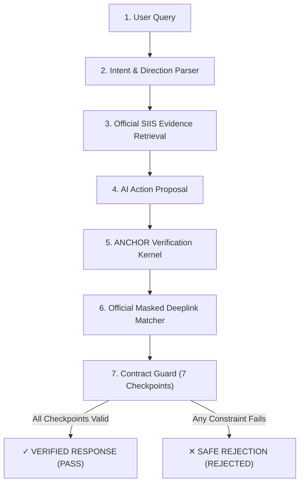

# ANCHOR — Proof-Carrying Troubleshooting Engine

> **Samsung PRISM Generative AI Hackathon 2026–27**  
> **Theme 2:** Guided Troubleshooting  
> *"AI can propose an action. ANCHOR proves whether that action is grounded in official Samsung evidence and backed by an authorized deeplink. If proof is missing, ANCHOR refuses execution."*

---

## 1. Project Overview

**ANCHOR** is a proof-carrying troubleshooting verification engine designed for Samsung mobile and tablet ecosystems. Rather than allowing conversational LLMs to directly hallucinate device settings actions, ANCHOR introduces a deterministic cryptographic-grade **Contract Guard** between generative AI proposals and device execution.

---

## 2. The Problem

Generative troubleshooting assistants frequently suffer from three critical failure modes:
1. **Action Hallucination:** Recommending actions that have no software settings page or settings deeplink on the device.
2. **Directional Inversion:** Inverting safety toggles (e.g., enabling touch sensitivity when the user asked to turn it off, or toggling orientation when the device is locked).
3. **Dead Hardware Fallacies:** Proposing cloud backup or software toggle settings on completely black, dead, or powered-off screens that require physical hardware intervention (such as holding Volume Down + Power for 20 seconds).

---

## 3. The ANCHOR Solution

ANCHOR introduces an unbypassable proof-carrying architecture where the generative AI is strictly restricted to **proposing** candidate actions. A deterministic verification kernel—**ANCHOR Contract Guard**—evaluates the proof against official Samsung SIIS documentation and an authoritative catalog of 578 masked settings deeplinks before any action is authorized.

---

## 4. Core Architecture Pipeline



---

## 5. Why ANCHOR Is Different

| Traditional GenAI Assistants | ANCHOR Troubleshooting Engine |
|---|---|
| Treats LLM output as authoritative truth | Treats AI output as an unverified proposal |
| Silently hallucinates non-existent settings | Verifies deeplink against 578 official masked URIs |
| Cannot prove why an action was chosen | Builds an interactive Evidence Graph carrying provenance |
| Forces an answer for 100% of queries | Safely rejects unsupported or physical hardware problems |
| Recommends software backup for dead screens | Identifies physical button recovery and blocks software links |

---

## 6. AI vs. ANCHOR Responsibility Separation

$$\textbf{AI PROPOSES} \quad \longrightarrow \quad \textbf{ANCHOR VERIFIES} \quad \longrightarrow \quad \textbf{ONLY VERIFIED ACTIONS EXECUTE}$$

- **AI Responsibility (Proposal Only):** Semantic understanding, intent extraction, direction recognition, and drafting candidate troubleshooting steps.
- **ANCHOR Responsibility (Deterministic Verification):** Verifying that evidence exists in Samsung SIIS documentation, confirming explicit textual support, validating direction compatibility (`ENABLE` vs `DISABLE`), enforcing catalog match in `deeplinks.json`, and validating Pydantic schemas in `schema.py`.

---

## 7. Official Student Kit Grounding

ANCHOR executes strictly against the official **Samsung Theme 2 Student Kit**:
- **Queries:** `server/data/student-kit/input.txt` (20 official benchmark evaluation queries)
- **SIIS Knowledge Base:** `server/data/student-kit/siis_responses.json` (20 official Samsung SIIS responses)
- **Deeplink Catalog:** `server/data/student-kit/deeplinks.json` (578 official masked settings URIs)
- **Schema Specification:** `server/data/student-kit/schema.py` (`ContextDeeplinkResponse` Pydantic model)
- **Reference Response:** `server/data/student-kit/sample_output.json` (Samsung reference output)

Zero mock or demo records leak into production evaluation.

---

## 8. The Contract Guard (7 Enforced Checkpoints)

The **Contract Guard** (`server/engine/contractGuard.js`) guarantees that an action reaches the response context **only** when all 7 checkpoints pass:
1. **Evidence Grounding:** Relevant SIIS record retrieved with $\ge 50\%$ semantic relevance.
2. **Explicit Action Support:** The proposed action is explicitly documented in the retrieved SIIS text steps (`EXPLICIT` support level).
3. **Hardware Manual Step Guard:** If the SIIS text prescribes physical button holding (e.g. Volume Down + Power for 20s) or charger inspection, ANCHOR rejects software execution.
4. **Authoritative Catalog Deeplink:** The deeplink matches an existing masked URI (`voiceassist://masked/act/...`) in `deeplinks.json`.
5. **Directional Safety:** `intent.targetDirection === action.direction === deeplink.direction` (`ENABLE` vs `DISABLE`).
6. **Query & Intent Integrity:** Query is non-empty and non-ambiguous.
7. **Pydantic Schema Validation:** The constructed payload passes strict validation against `schema.py`.

---

## 9. PASS vs. REJECT Examples

### PASS Example: Auto Rotate Calibration (Scenario 1)
- **User Query:** *"My Nexa A14 screen looks distorted right after I received the phone and I need a test."*
- **Intent:** `SCREEN_ROTATION` (`ENABLE`)
- **Retrieved SIIS:** `#SIIS-ROW_20` (`Display > Screen rotation`)
- **AI Proposal:** `Enable Auto Rotate` (Explicitly Supported: `true`)
- **Deeplink:** `voiceassist://masked/act/7c340914be` (`DL-0461`, Catalog: `VALID`)
- **Verdict:** **`PASS ✔`**
- **Evidence Graph:** Fully illuminated green/cyan path from user complaint to validated response.

### REJECT Example: Floating Circle Removal (Scenario 3)
- **User Query:** *"My Nexa X1 has a floating circle that opened a panel. Remove it."*
- **Intent:** `MULTI_WINDOW`
- **Retrieved SIIS:** `#SIIS-ROW_12` (`Advanced features > Multi window`)
- **AI Proposal:** `Customize the Quick Access panel` (Explicitly Supported: `false`)
- **Deeplink:** `None` (Catalog: `INVALID`)
- **Verdict:** **`REJECTED ✕`**
- **Exact Reason:** *"Proposed action 'Customize the Quick Access panel' is not explicitly supported by the retrieved Samsung SIIS evidence."*
- **Evidence Graph:** Red terminating edge routing directly to the `Rejection Terminal`.

---

## 10. Technology Stack

- **Frontend:** Vue 3, Vite, JetBrains Mono & Inter typography, Vanilla CSS with custom cyan neon design tokens.
- **Backend:** Node.js (ES Modules), Express, in-process deterministic vector/semantic search.
- **Validation:** Python 3 + Pydantic v2 (executing official Samsung `schema.py`).
- **Orchestration:** `concurrently` managing backend (port 3001) and frontend (port 5173).

---

## 11. Project Structure

```
ANCHOR/
├── dist/                              # Compiled production distribution
├── public/                            # Static assets and favicons
├── server/
│   ├── data/
│   │   ├── student-kit/               # Official Samsung Student Kit files
│   │   │   ├── input.txt              # 20 official benchmark queries
│   │   │   ├── siis_responses.json    # 20 official SIIS records
│   │   │   ├── deeplinks.json         # 578 official masked deeplinks
│   │   │   ├── schema.py              # Official Pydantic schema
│   │   │   ├── sample_output.json     # Official reference response
│   │   │   └── siisLoader.js          # Explicit grounding parser
│   │   └── index.js                   # Authoritative data gateway
│   ├── engine/
│   │   ├── intentParser.js            # Directional intent classifier
│   │   ├── evidenceRetriever.js       # SIIS semantic search
│   │   ├── actionCompiler.js          # Action compiler with explicit grounding
│   │   ├── deeplinkResolver.js        # Catalog matcher
│   │   ├── contractGuard.js           # 7-checkpoint gatekeeper
│   │   ├── graphBuilder.js            # Dynamic Evidence Graph compiler
│   │   └── pipeline.js                # Full diagnostic pipeline
│   ├── tests/
│   │   ├── pipeline.test.js           # 15 scenario automated regression suite
│   │   ├── final-grounding-audit.json # Machine-readable 20-query audit report
│   │   └── final-grounding-audit.md   # Markdown 20-query audit report
│   └── index.js                       # Express API server (port 3001)
├── src/
│   ├── components/                    # 12 active locked dashboard components
│   │   ├── ActionCard.vue             # AI Proposal vs ANCHOR Verification
│   │   ├── DeeplinkCard.vue           # Official Masked Deeplink Card
│   │   ├── EvidenceGraph.vue          # Interactive SVG Evidence Graph
│   │   ├── EvidenceProofPanel.vue     # Bottom Evidence Proof Panel
│   │   ├── Header.vue                 # System status bar
│   │   ├── IntentCard.vue             # Intent & Direction Analysis
│   │   ├── PipelineStatusPanel.vue    # Stepper pipeline status
│   │   ├── ProofVerificationPanel.vue # Integrity & Constraint panel
│   │   ├── Sidebar.vue                # Navigation rail
│   │   ├── SiisEvidenceCard.vue       # Direct SIIS quote & badge
│   │   ├── UserQueryCard.vue          # Query input & 3 Demo Mode scenarios
│   │   └── ValidationCard.vue         # Contract checklist & overall status
│   ├── App.vue                        # Main dashboard orchestration
│   ├── index.css                      # Global console styling & tokens
│   └── main.js                        # Vue 3 entry point
├── package.json                       # Scripts and dependencies
├── requirements.txt                   # Python Pydantic requirements
├── vite.config.js                     # Vite build & proxy config
├── .env.example                       # Environment template
└── PHASE-8-FINAL-READINESS.md         # Submission audit report
```

---

## 12. Quick Start & Installation

### Prerequisites
- **Node.js:** v18.0.0 or higher
- **Python:** v3.9+ with `pydantic>=2.0.0`

### 1. Install Node Dependencies
```bash
npm install
```

### 2. Install Python Dependencies
```bash
pip install -r requirements.txt
```

### 3. Run the Full Application (Backend + Frontend)
```bash
npm start
```
- Backend starts at: `http://localhost:3001`
- Frontend starts at: `http://localhost:5173`

---

## 13. Running Automated Tests

Run the full 15-scenario regression test suite:
```bash
npm test
```
**Result:** 57/57 passed assertions, 0 failed.

---

## 14. Building for Production

```bash
npm run build
```
Generates an optimized client bundle in `dist/` ready for deployment.

---

## 15. Live Demo Scenarios for Judges

The **User Query Card** features 3 pre-configured demo scenario buttons:

1. **Scenario 1 — Verified Auto Rotate (`PASS ✔`):**
   - Click `S1: Auto Rotate [PASS]`
   - Demonstrates: Distorted display symptom $\rightarrow$ Orientation lock intent $\rightarrow$ SIIS `#SIIS-ROW_20` grounding $\rightarrow$ Masked Deeplink `act/7c340914be` $\rightarrow$ Green verified Evidence Graph path.

2. **Scenario 2 — Verified Data Backup (`PASS ✔`):**
   - Click `S2: Data Backup [PASS]`
   - Demonstrates: Cracked screen symptom $\rightarrow$ Cloud data backup action grounded per `sample_output.json` $\rightarrow$ Masked Deeplink `act/b3ed3ed663` $\rightarrow$ Green verified Evidence Graph path.

3. **Scenario 3 — Safe Rejection (`REJECTED ✕`):**
   - Click `S3: Floating Circle [REJECTED]`
   - Demonstrates: Request to remove floating circle $\rightarrow$ Action unsupported in SIIS doc $\rightarrow$ No catalog deeplink exists $\rightarrow$ Contract Guard blocks execution $\rightarrow$ Red terminating Evidence Graph path.

4. **New Query Reset (`IDLE ○`):**
   - Click `New Query`
   - Demonstrates: Full reset to clean idle state, stopping all animations without stale pass/fail verdicts.

---

## 16. The ANCHOR Safety Principle

> *"ANCHOR's core value is not that it forces an answer to 20/20 queries. Its value is that it proves why an answer is safe to execute—and refuses to hallucinate a software settings deeplink when a device's screen is physically black or when no catalog deeplink exists."*
